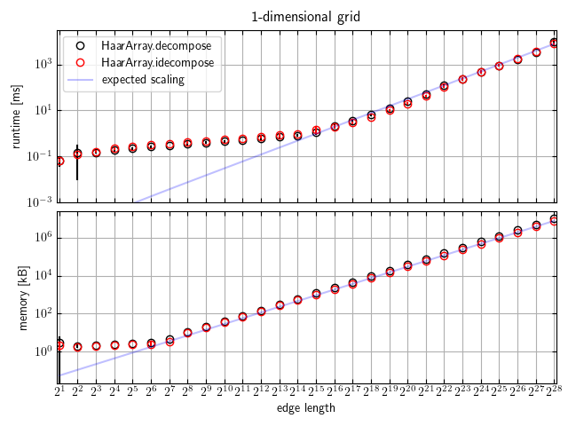
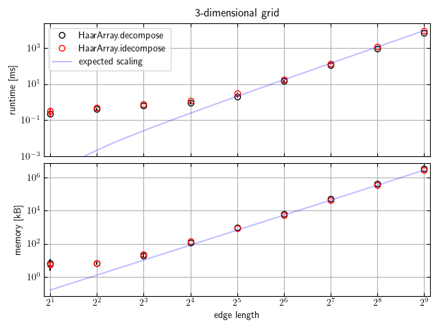

# Runtime and Memory Scaling

I first demonstrate that both the runtime and memory requirements are linear in the total number of grid points.
Specifically, I expect
```
runtime ~ Ngrid**(Ndim-1) * (Ngrid * 2*(1 - 0.5**(log(Ngrid)/log(2))) ~ Ngrid**Ndim
```
based on an incomplete geometric sum for the number of opperations required to decompose each axis and
```
memory ~ Ngrid**Ndim
```
These scalings hold very well once the problem size gets large enough that Haar transform dominates over the the python overhead (function calls, etc).

|Ndim|figure|
|---|---|
| 1 ||
| 2 ||
| 3 ||
