As a simple test, I construct a scalar field within the unit-cube as follows

  * independent draws from a standard normal distribution at each grid point: `f ~ np.exp(-0.5*f**2)`
  * an additive "vertical tube" with a smaller amplitude than the Gaussian noise: `f = 0.5*np.exp(-0.5*((x-0.5)**2 + (y-0.5)**2)/0.1**2)`

I consider a unit-cube with `256` grid points per side.
I then take Haar decompositions of the field and look for the appearence of structure.

These plots were generated via

```
./test -v -f dens -n 256 --seed 123
```

## 2-dimensional tests (looking at the mid-plane)

First, I examine the behavior of the field at different scales along the mid-plane (`z=0.5`).
Structure identified in this slice therefore only uses spatial information from the x- and y-directions.

Note that we beging to see structure after only a few decompositions (spatial averaging).
The histogram of approx coefficients begins to show a clear tail.
Note, however, that the distribution of detail coefficients remains quite Gaussian.

|resolution|figure|
|---|---|
|256^2||
|128^2|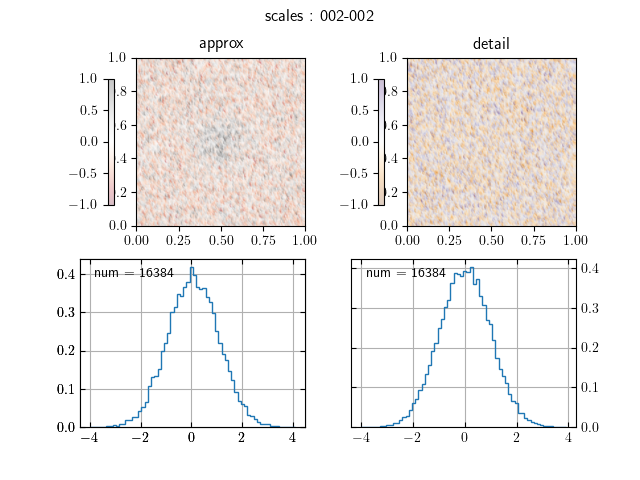|
| 64^2|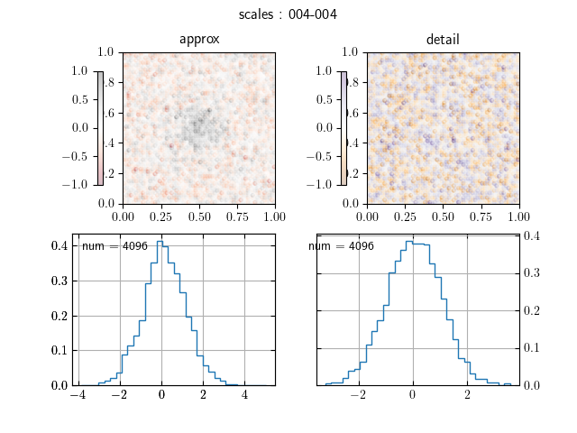|
| 32^2|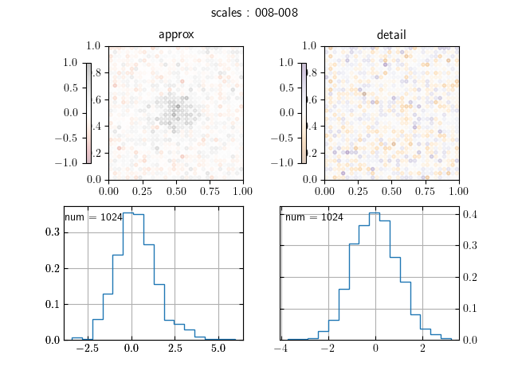|

## 2-dimensional tests (collapsed along the z-axis)

We then consider 2-dimensional structure when we first completely decompose the field along the z-axis (i.e., take the average of all values along the z-axis at each x- and y-position separately).
In this case, the structure is much more visible immediately.
This is likely because the coordinate system is aligned with the direction of the "vertical tube"

|resolution|figure|
|---|---|
|256^2|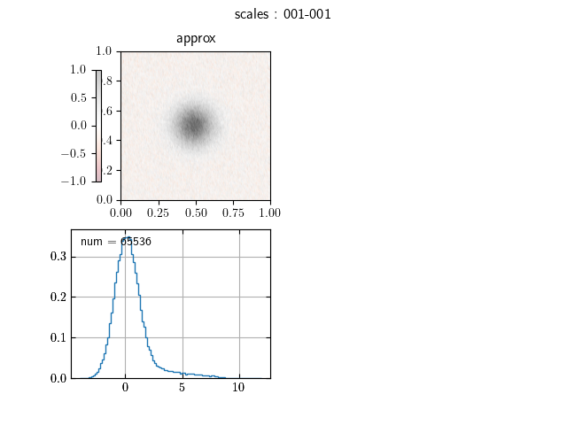|
|128^2|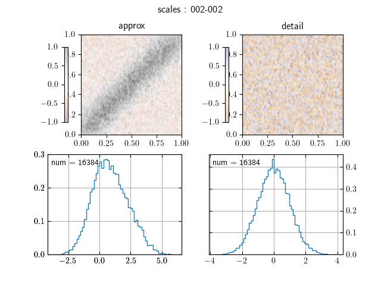|
| 64^2|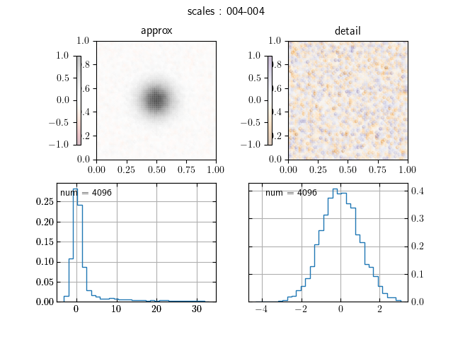|
| 32^2|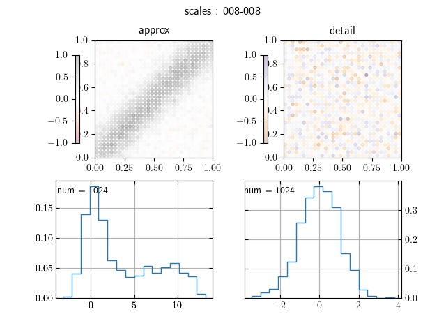|

## 3-dimensional tests

Finally, we also examine 3-dimensional decompositions to look for the appearence of structure.
While the vertical tube is aligned with the z-axis, this is likely not a necessary assumption for structure discovery.
It is surely helpful, but the 3D structure is clearly visible even with minimal spatial averaging through the Haar decomposition.

Note again that the distribution of approx coefficients develops a long tail, whereas the distribution of detail coefficients remains consistently Gaussian.

|resolution|figure|
|---|---|
|256^3|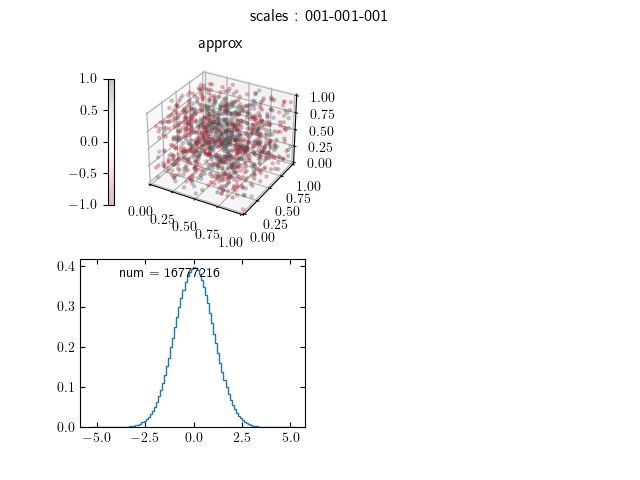|
|128^3|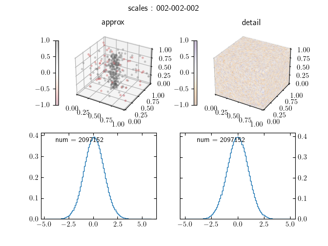|
| 64^3|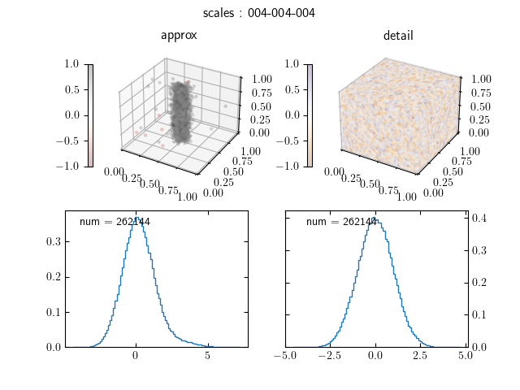|
| 32^3|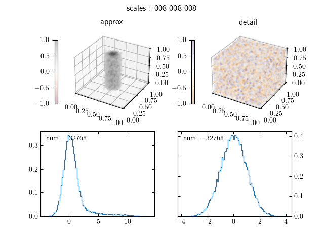|

As a further proof of principle, I repeated the experiment but with a tube that is not aligned with any of the coordinate axes.
The approx coefficients are still able to quickly identify the structure and show similar statistical behavior in the distributions over positions at different resolutions.

|resolution|figure|
|---|---|
|256^3|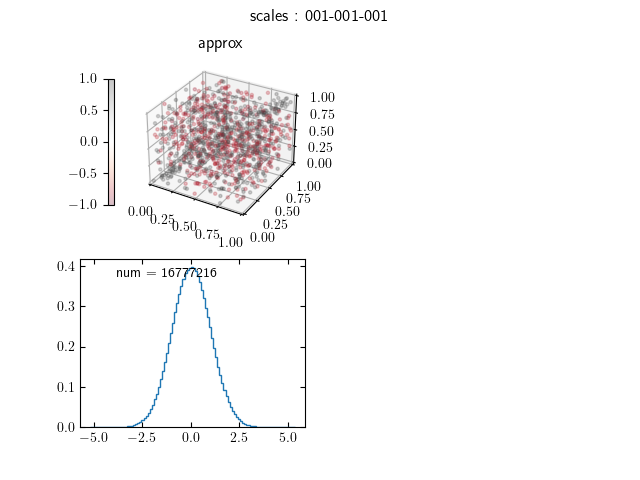|
|128^3||
| 64^3|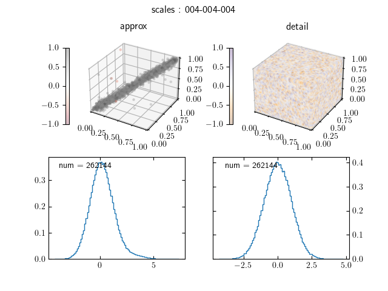|
| 32^3|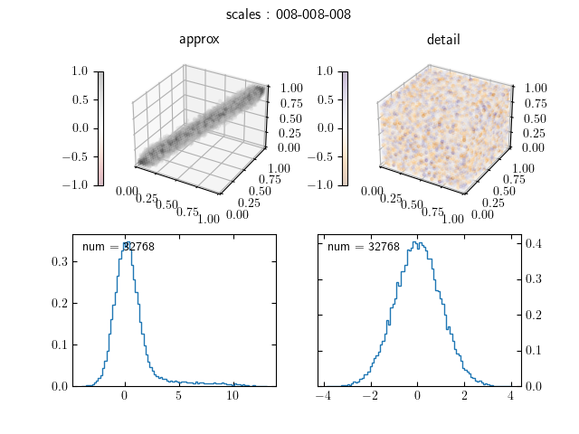|
